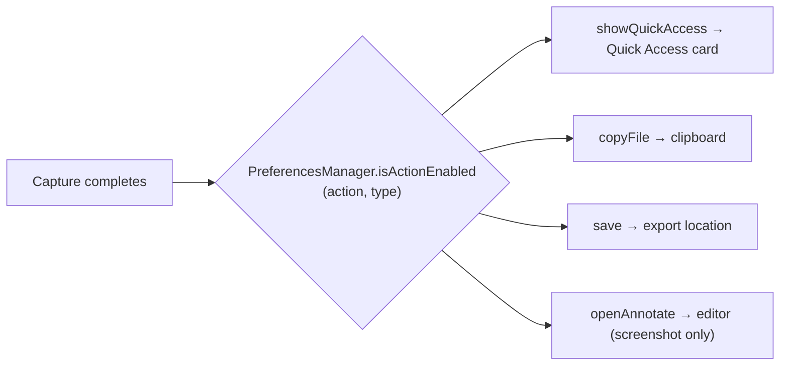

# Preferences

Reference for the Settings window: sidebar structure, every section, and how preferences are stored. Verified against `Cue/Features/Preferences/` at HEAD (`v1.30.0-beta.4`).

## Root

- `PreferencesView` (`Cue/Features/Preferences/PreferencesView.swift`) — SwiftUI `NavigationSplitView` with a native sidebar, fixed 760×550, seven destinations when Video is off / eight with Screen Recording (no About/update/report destination; no dedicated Annotate or Permissions destination).
- Selection driven by `PreferencesNavigationState.shared.selectedTab` (`Models/PreferencesNavigationState.swift`, `PreferencesTab` enum) — set programmatically from menu bar, deep links (`cue://settings?tab=`, see [SHORTCUTS.md](SHORTCUTS.md)), and the shortcut overlay. Legacy `annotate` deep links open **General**. Legacy `permissions` / `privacy` deep links and a persisted `permissions` selected tab open **Advanced**.
- Presented through the `Settings` scene in `CueApp`; activation-policy dance handled by `AppStatusBarController` (see [APP_LIFECYCLE.md](APP_LIFECYCLE.md)).

## Storage pattern

- Simple prefs: `@AppStorage(PreferencesKeys.*)` directly in views; keys centralized in `Cue/Features/Preferences/Models/PreferencesKeys.swift`.
- Complex structured prefs: `PreferencesManager.shared` (`PreferencesManager.swift`) behind the `PreferencesProviding` protocol (`PreferencesProviding.swift`) for DI.
- TOML export/import covers most prefs — see [CONFIGURATION.md](CONFIGURATION.md).
- Upload provider credentials stay in Keychain. Cloudflare additionally stores its HTTPS Worker URL in UserDefaults; its UPLOAD_TOKEN is never exported.

### Uploads

Select ImgBB (default), ImageKit, or Cloudflare Worker. Cloudflare setup offers
token generation, explicit reveal/copy actions, a link to the official
Worker documentation, and Verify Connection. Uploads remain manual; no provider
fallback is automatic.

## Sidebar destinations

### General (`PreferencesGeneralSettingsView.swift`)

- **App**: Start at Login (`LoginItemManager` / SMAppService), Show Menu Bar Icon (`showMenuBarIcon`).
- **Capture**:
  - Hide Desktop Icons (`hideDesktopIcons`), Hide Desktop Widgets (`hideDesktopWidgets`).
  - All-In-One Modes: `Customize…` opens a sheet (`PreferencesAllInOneModeCustomizationContent`) to reorder and enable toolbar modes using `capture.allInOne.modeOrder.v1` and `capture.allInOne.enabledModes.v1`. Reset restores the default order and enables every mode. Recording appears only when Video is available, while its saved position and enabled state are retained. At least one non-Video mode must remain enabled.
- **Annotate**:
  - Sync Tool Defaults / quick-properties sync (`annotate.quickPropertiesSyncEnabled`, default on).
  - Combine Save-as-Edit (`annotate.combineSaveAsEdit`, default on).
  - Clipboard image open behavior (`annotate.clipboardImageOpenBehavior`): `ask` (default) / `loadAutomatically` / `doNothing` (`AnnotateClipboardImageBehavior`).
  - Close After Drag (`annotate.closeAfterDrag`, default on).
  - Bring Forward After Drag (`annotate.bringForwardAfterDrag`, default off; disabled when Close After Drag is on).
  - Toolbar / Bottom bar: each has a `Customize…` sheet (`AnnotateChromeCustomizationContent`) to reorder and enable/disable items. Toolbar: crop, background, rotate, drawing tools, cutout, Save as. Bottom bar: New window, Share, selected-provider upload, Pin, Copy, Delete. The persisted `uploadToImgBB` raw action remains a compatibility identifier. Selection, Undo, Redo, and Done always stay visible; zoom, pan, mode tabs, and Drag to app are fixed. Keys `annotate.chrome.toolbarOrder.v1`, `annotate.chrome.bottomOrder.v1`, `annotate.chrome.enabled.v1`; Reset chrome restores defaults. Inline Capture Markup uses the same drawing-tool order/enable subset.
- **Sounds**: Play Sounds (`playSounds`).
- **Export**: Save Location (`exportLocation` + `exportLocation.bookmark`, via `SandboxFileAccessManager`).
- **After Capture**: Action matrix (`PreferencesAfterCaptureMatrixView`); see below.
- **Appearance**: Language row (`PreferencesLanguageSettingRow`), theme picker (`AppearanceModePicker` → `appearanceMode`).
- **Help**: Restart Onboarding (`OnboardingFlowView.resetOnboarding()` + `.showOnboarding`).

### Capture / Screenshot (`PreferencesCaptureSettingsView.swift`)

Screenshot-oriented destination (sidebar label **Screenshot**). Screen recording
gets its own sidebar destination when the Video module is compiled in.

- **Output**: Image Format (`screenshot.format`, `ImageFormatOption`; WebP warning, JPEG cutout note) + default annotate canvas preset (`PreferencesScreenshotDefaultPresetPicker`).
- **Capture**: Include Cue windows (`screenshot.includeOwnApp`), Show Cursor (`screenshot.showCursor`), Freeze Area (`screenshot.freezeArea`).
- **Window Screenshots**: Capture window shadow (`capture.windowShadow`).
- **Selection & Snapping**: Selection Area Overlay, Reverse Magnifier Zoom, snapping toggle + advanced snap distance / guides / color sensitivity (`capture.selection.*`) — applies to All-In-One resize refinement.
- **Post-Processing**: Auto-Crop Subject (`backgroundCutout.autoCropEnabled`).
- **Specialized Capture**: Scrolling Capture session hints (`scrollingCapture.showHints`) + OCR Success Notification (`ocr.successNotificationEnabled`).
- Scoped **Reset Defaults** for this screen’s screenshot keys and default preset.

### Screen Recording (`PreferencesScreenRecordingSettingsView.swift`)

Optional Video-module destination: format, quality, cursor/camera preview, hover bar,
mouse highlight, keystroke overlay, and audio/microphone controls. See the
Screen Recording settings view for the current control set.

### Quick Access (`PreferencesQuickAccessSettingsView.swift`)

- **Actions**: `QuickAccessActionCustomizationView` — action enable/order/slot assignment with live preview card (`PreferencesQuickAccessPreviewCard`); keys `quickAccess.actions.*`, `quickAccess.swipe.action.*`.
- **Position**: screen edge left/right (`floatingScreenshot.position`).
- **Appearance**: overlay size slider 0.75–1.5 (`floatingScreenshot.overlayScale`).
- **Behaviors**: floating overlay enable (`floatingScreenshot.enabled`), Auto-Close toggle + 3–30 s slider (default 10, `floatingScreenshot.autoDismiss*`) + Pause on Hover, Hide Card When Window Open (`quickAccess.hideCardWhenWindowOpen`), Animation Style (`quickAccess.animationStyle`), Drag & Drop (`floatingScreenshot.dragDropEnabled`), Two-Finger Swipe to Dismiss + sensitivity 0.5–3.0 (`floatingScreenshot.twoFingerSwipe*`).
- **Trackpad Swipe Mode**: mode picker (`quickAccess.trackpad.swipe.mode`) + swipe-action hints; visible when swipe-to-dismiss is on.

### History (`PreferencesHistorySettingsView.swift`)

- **Floating Panel**: enable (`history.floating.enabled`), Panel Position (`history.floating.position`).
- **Display**: Default Filter (all/screenshots/videos/gifs), Background Style (`history.backgroundStyle`, thumbnail picker).
- **Retention**: Retention Days 0–90, 0 = keep forever (`history.retentionDays`), Max Count 0–1000, 0 = unlimited (`history.maxCount`).
- **Storage**: capture storage size + Open Capture Storage (`CaptureStorageManager`), Clear History with confirmation (`HistoryWindowController.deleteRecords`).
- Master history enable (`history.enabled`) seeded on; see [APP_LIFECYCLE.md](APP_LIFECYCLE.md) for seeded defaults.

### Shortcuts (`PreferencesShortcutsSettingsView.swift`)

- Master toggle (`shortcutsEnabled`).
- Grouped recorders with per-shortcut enable toggles and per-section Reset: Capture, Recording, Tools, History, Quick Access, Annotate Actions, Annotate Tool Keys; Reset to Defaults (all).
- System-conflict guidance via `SystemScreenshotShortcutManager`.
- Full mechanics and default bindings: [SHORTCUTS.md](SHORTCUTS.md).

### Uploads (`PreferencesCloudSettingsView.swift`)

The **Uploads** section owns provider selection (ImgBB, ImageKit, or Cloudflare Worker), image optimization/derivative settings, and the selected provider credential. Secrets are stored only in provider-scoped Keychain items and are not exported. Existing users retain ImgBB unless they explicitly select another provider; invalid or missing selection safely uses ImgBB. GIFs can be uploaded through either provider; MOV/MP4/M4V uploads are supported by ImageKit or Cloudflare. When ImageKit is selected, the plan picker controls the local video upload target (Free 100 MB, Lite 300 MB, Pro 2 GB, or custom) because ImageKit does not expose plan limits through its API. Cloudflare uses a fixed 95 MiB client target. The Cloudflare documentation link covers the BYO Worker setup; Cue does not deploy a companion Worker. UploadThing is unavailable. BYO provider settings, usage, password, transfer, and upload-history controls remain retired. See [CLOUD.md](CLOUD.md).

### Advanced (`PreferencesAdvancedSettingsView.swift`)

- **Permissions** (`PreferencesPermissionsSettingsView.swift` / `PermissionsSettingsSection`): status rows + System Settings deep links for Screen Recording (`Privacy_ScreenCapture`), Save Folder (`Privacy_FilesAndFolders`), Microphone (`Privacy_Microphone`, when Video is available), and Accessibility (`Privacy_Accessibility`). Shows `grantedButUnavailableDueToAppIdentity` when `AppIdentityManager` reports issues (see [APP_LIFECYCLE.md](APP_LIFECYCLE.md)).
- **Backup**: TOML Import / Export / Restore Defaults (`CueConfiguration*` services).
- **Configuration File**: grant access to `~/.config/cue`, Sync Now, Open Config, status/issues — see [CONFIGURATION.md](CONFIGURATION.md).
- **Integration**: URL Scheme toggle (`urlSchemeEnabled`).
- **Diagnostics**: enable toggle (`diagnostics.enabled`), retention days (`diagnostics.retentionDays`, default 3, range 1–30 via `LogCleanupScheduler`), Open Folder (`~/Library/Logs/Cue`) — see [UPDATES.md](UPDATES.md).

## After-capture matrix

- `AfterCaptureAction` (4 cases) × `CaptureType` (2: screenshot, recording) — defined in `PreferencesManager.swift`.
- Defaults: `showQuickAccess`, `copyFile`, `save` = on for both types; `openAnnotate` = off (opt-in, screenshot-only).
- Stored as JSON `[String: [String: Bool]]` under UserDefaults key `afterCaptureActions`; load failures fall back to seeded defaults.
- Edited via `PreferencesAfterCaptureMatrixView.swift` (Capture → After Capture section).
- **Plan 089**: Generic BYO cloud uploads and their after-capture UI were retired. Local sharing and the selected ImgBB, ImageKit, or Cloudflare upload remain — see [CLOUD.md](CLOUD.md).

## Related docs

- [SHORTCUTS.md](SHORTCUTS.md) — shortcut mechanics, defaults, conflicts
- [CLOUD.md](CLOUD.md) — Uploads settings and image-host sharing boundary
- [UPDATES.md](UPDATES.md) — local diagnostics and manual upgrade notes
- [APP_LIFECYCLE.md](APP_LIFECYCLE.md) — seeded defaults, activation policy, onboarding
- [CONFIGURATION.md](CONFIGURATION.md) — TOML backup/sync of these prefs
- [QUICK_ACCESS.md](QUICK_ACCESS.md) — overlay behavior details
- [HISTORY.md](HISTORY.md) — retention and storage internals
