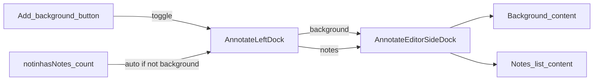

# Plan 068: Shared left dock for Background and Notes + rename Add background

> **Executor instructions**: Follow this plan step by step. Run every
> verification command and confirm the expected result before moving to the
> next step. If anything in the "STOP conditions" section occurs, stop and
> report — do not improvise. When done, update the status row for this plan
> in `plans/README.md` — unless a reviewer dispatched you and told you they
> maintain the index.
>
> **Drift check (run first)**:
> `git diff --stat d33a2883..HEAD -- \
>   Notinhas/Features/Annotate/AnnotateMainView.swift \
>   Notinhas/Features/Annotate/AnnotateState.swift \
>   Notinhas/Features/Annotate/Components/AnnotateSidebarView.swift \
>   Notinhas/Features/Annotate/Components/AnnotateToolbarView.swift \
>   Notinhas/Features/Notinhas/Views/NotinhasNotesSidePanelView.swift \
>   Notinhas/Shared/Localization/L10n.swift \
>   docs/ANNOTATE.md \
>   CONTEXT.md`
> On blocking mismatch, STOP.

## Status

- **Priority**: P1
- **Effort**: L
- **Risk**: MED
- **Depends on**: none code-wise; product sequence **after** 067 preferred
- **Category**: direction / architecture
- **Planned at**: commit `d33a2883`, 2026-07-24

## Execution profile

- **Recommended profile**: `implementer`
- **Risk/lane**: `Medium/Full`
- **Parallelizable**: `no` with 067 annotate chrome — serialize
- **Reviewer required**: `yes` — exclusive dock state + localization
- **Rationale**: Shared chrome + exclusive visibility rules + rename of a user-facing action.
- **Escalate when**: Product asks for tabs (Background|Notes) instead of exclusive mode.

## Why this matters

Background customization uses a left [`AnnotateSidebarView`](Notinhas/Features/Annotate/Components/AnnotateSidebarView.swift). Notes summary uses a separate right [`NotinhasNotesSidePanelView`](Notinhas/Features/Notinhas/Views/NotinhasNotesSidePanelView.swift) with different chrome. Product wants one shared sidebar **shell** (appearance + scroll/frame behavior) hosting either Background or Notes content, **exclusive** on the **left**. Also rename toolbar/action **“Toggle sidebar” → “Add background”**.

## Confirmed product decisions

1. **Placement:** Left dock, same position as today’s background sidebar.
2. **Exclusivity:** Background **or** Notes — never both. Opening one replaces the other.
3. **Notes visibility:** Auto-show Notes in the left dock whenever there is ≥1 note (same trigger as today’s auto panel), unless the user currently has Background open — then Background stays until dismissed; dismissing Background with notes remaining returns to Notes.
4. **Rename:** User-facing “Toggle sidebar” → “Add background” (tooltip, shortcuts prefs labels, overlay copy). Keep internal API names stable where renaming would churn config keys (`toggleSidebar` action kind / UserDefaults keys may stay for compatibility).

## Current state

```33:73:Notinhas/Features/Annotate/AnnotateMainView.swift
      HStack(spacing: 0) {
        if state.showSidebar, state.editorMode != .preview {
          AnnotateSidebarView(state: state)
            .frame(width: 240)
            ...
        }
        // canvas ...
        if !state.notinhasNotes.isEmpty, state.editorMode != .preview {
          NotinhasNotesSidePanelView(...)
            .frame(width: 264)
            .padding(12)
        }
      }
```

- `showSidebar` + `toggleSidebarVisibility()` drive background.
- Notes panel is independent on the right; preference `notinhasNotesPanelSide` exists but MainView hardcodes right.

## Target state model

Introduce an exclusive left-dock mode on `AnnotateState` (name can vary; behavior fixed):

```swift
enum AnnotateLeftDock: Equatable {
  case hidden
  case background
  case notes
}
```

Rules:

| Event | Result |
|-------|--------|
| `notinhasNotes` becomes non-empty and dock ≠ `.background` | dock → `.notes` |
| `notinhasNotes` becomes empty and dock == `.notes` | dock → `.hidden` |
| User activates Add background (toggle on) | dock → `.background` |
| User dismisses background (toggle off) | dock → `.notes` if notes non-empty, else `.hidden` |
| Preview mode | dock hidden (same as today) |

Toolbar button selected when `dock == .background`. Icon may stay `rectangle.on.rectangle` unless a clearer SF Symbol is already used nearby — do not invent a new icon system.

## Shared shell

Extract a thin chrome wrapper (new file under Annotate/Components), e.g. `AnnotateEditorSideDock`:

- Fixed width **240** (match background today; drop Notes’ 264+padding floating card look)
- Full-height in the HStack (not floating rounded card over canvas)
- Vertical `ScrollView` + standard padding matching `AnnotateSidebarView`
- Optional title header slot
- Content: `@ViewBuilder` for Background vs Notes body

Refactor:

- `AnnotateSidebarView` body → content only inside the shell (or become the background content view).
- `NotinhasNotesSidePanelView` → list content only (no independent material card / width); host supplies chrome. Preserve row UI (badge, text, Point/Rect, delete).



## Rename surface

- [`L10n.AnnotateUI.toggleSidebar`](Notinhas/Shared/Localization/L10n.swift) default → **"Add background"**; update comment; prefer new key `annotate.add-background` **or** keep key and change defaultValue (match repo L10n patterns — prefer changing defaultValue + comment if key is widely referenced).
- Shortcut overlay / Preferences shortcuts row labels that use that string.
- Docs: `docs/ANNOTATE.md`, `docs/SHORTCUTS.md` if they say “Toggle sidebar”.
- `CONTEXT.md`: if “sidebar” vocabulary is ambiguous, add **Dock lateral do editor** / clarify Background vs Notes content — only if terms need sharpening.

Do **not** rename `AnnotateActionShortcutKind.toggleSidebar` raw value / UD keys in this plan (compatibility).

## Preferences

- `PreferencesKeys.notinhasNotesPanelSide` / Preferences UI picker for left/right notes panel: **remove or disable** the side picker (Notes always use left exclusive dock). Prefer removing the control and ignoring stored value; leave key unread for one release to avoid migration churn, or delete picker only.

## Scope

**In scope:**

- `AnnotateState` dock mode + exclusivity + auto notes rules
- `AnnotateMainView` single left dock host
- New shared shell component
- Refactor `AnnotateSidebarView` / `NotinhasNotesSidePanelView` into shell + content
- Toolbar tooltip / selected state for Add background
- L10n + shortcut overlay + Preferences annotate shortcuts label
- Preferences annotate settings: drop notes panel side picker
- Tests for dock transitions (notes auto-open, exclusive with background, dismiss restores notes)
- `docs/ANNOTATE.md` (+ SHORTCUTS if needed)
- `plans/README.md`
- Optional small CONTEXT.md glossary tweak

**Out of scope:**

- Tabs Background|Notes in one panel (rejected — exclusive B)
- Keeping Notes on the right
- Quick properties overlap (067)
- VideoEditor sidebars
- Renaming persistence keys for `toggleSidebar`

## Steps

### Step 1: State machine

Add `AnnotateLeftDock` (or equivalent) and replace dual `showSidebar` + right notes visibility with the table above. Keep a computed `showSidebar` alias **only if** many call sites need it — prefer updating call sites cleanly.

### Step 2: Shell + content split

Create `AnnotateEditorSideDock`. Move chrome out of notes panel; keep background content structure.

### Step 3: Wire MainView

One left `if dock != .hidden` branch; switch content.

### Step 4: Rename + prefs

L10n Add background; remove notes side picker.

### Step 5: Tests + docs + format

XCTest for dock rules; update docs; `swiftformat`; `./scripts/run-tests.sh --skip-visual`.

## Done criteria

- [ ] Notes never appear as a separate right floating panel
- [ ] Left dock shows Notes automatically when ≥1 note and Background is not open
- [ ] Add background opens Background and hides Notes; dismissing Background restores Notes if any remain
- [ ] Shared shell used for both contents (same width/scroll/padding family)
- [ ] User-visible string is “Add background” (not “Toggle sidebar”)
- [ ] Notes side preference UI gone or inert
- [ ] Tests cover exclusivity + auto notes; README 068 updated

## STOP conditions

- Product asks for simultaneous Background+Notes — conflicts with B; STOP.
- Mockup mode sidebar (`AnnotateMockupMainView`) needs a different exclusivity story — STOP and report before inventing a third dock.
- Localization key change breaks config import tests — fix tests or keep key; do not invent dual strings.

## Maintenance notes

- Reviewers: activate Note, add pin, confirm left Notes dock; open Add background, confirm Notes hide; close background, Notes return; delete all notes, dock hides.
- Follow-up: optional SF Symbol more “background”-like; retire `notinhasNotesPanelSide` key entirely in a later cleanup.
